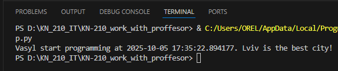
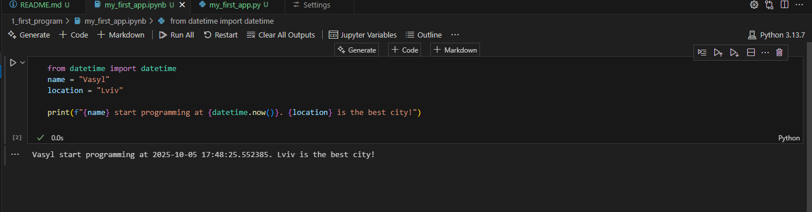
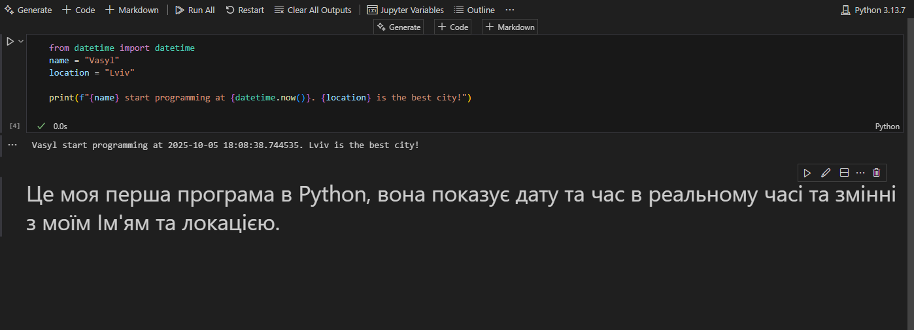

# Звіт до роботи

## Тема:
> _Оформлення робіт та перша програма_

## Мета роботи:
> _Створення першої програми в середовищі Python_

---

## Виконання роботи

### Результати виконання завдання
- Розробили / Створили: новий файл з розширенням py.
- Програма вивела значення: Vasyl start programming at 2025-10-05 17:35:22.894177. Lviv is the best city!
- Отримано наступні результати ...
- Навчились Створювати файли з розширенням py.


### 1-4 завдання <фото файл> 
 ---  ---


### 5-7 завдання (фото прикріплено знизу) 
 ---  ---

### 8-10 завдання
 ---  ---

#### Варіант вставки з URL (з використанням alt text):


#### Варіант вставки через локальні шляхи:


---

### Вставлений код / текстовий або числовий результат / інші результати:
```python
def simple_function_example():
    pass
