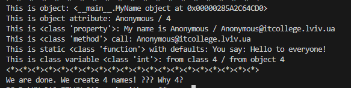
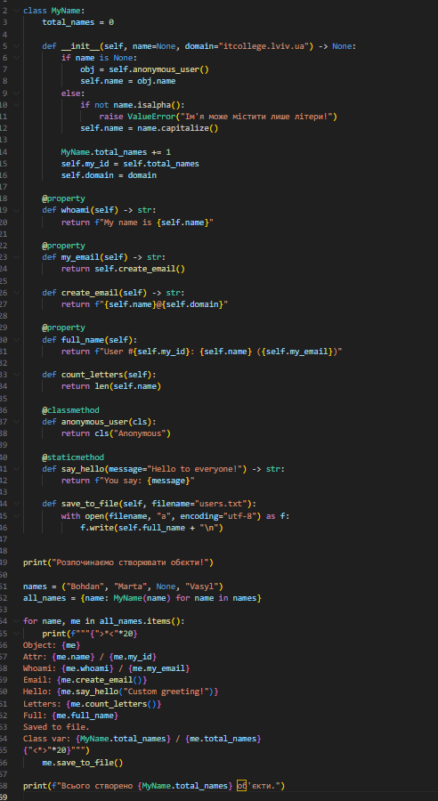
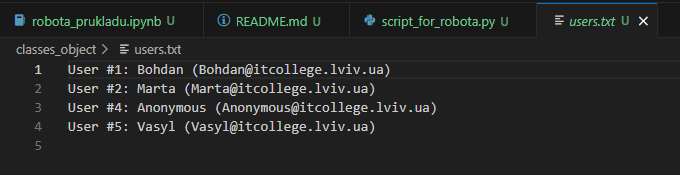

# Звіт до роботи

## Тема:
> _Робота з Класами та Обєктами_

## Мета роботи:
> _Навчитись використовувати основні принципи ООП, розглянути кострукції побудови класу та створення обєктів та навчитись працювати з ними_

---

## Виконання роботи

### Результати виконання завдання
- Розробили / Створили: новий файл з розширенням py.
- Програма вивела значення: Object: <__main__.MyName object at 0x000002138C586F90>      
Attr: Bohdan / 1
Whoami: My name is Bohdan / Bohdan@itcollege.lviv.ua        
Email: Bohdan@itcollege.lviv.ua
Hello: You say: Custom greeting!
Letters: 6
Full: User #1: Bohdan (Bohdan@itcollege.lviv.ua)
Saved to file.
Class var: 5 / 5
<*><*><*><*><*><*><*><*><*><*><*><*><*><*><*><*><*><*><*><*>
>*<>*<>*<>*<>*<>*<>*<>*<>*<>*<>*<>*<>*<>*<>*<>*<>*<>*<>*<>*<
Object: <__main__.MyName object at 0x000002138C804B90>      
Attr: Marta / 2
Whoami: My name is Marta / Marta@itcollege.lviv.ua
Email: Marta@itcollege.lviv.ua
Hello: You say: Custom greeting!
Letters: 5
Full: User #2: Marta (Marta@itcollege.lviv.ua)
Saved to file.
Class var: 5 / 5
<*><*><*><*><*><*><*><*><*><*><*><*><*><*><*><*><*><*><*><*>
>*<>*<>*<>*<>*<>*<>*<>*<>*<>*<>*<>*<>*<>*<>*<>*<>*<>*<>*<>*<
Object: <__main__.MyName object at 0x000002138C804CD0>
Attr: Anonymous / 4
Whoami: My name is Anonymous / Anonymous@itcollege.lviv.ua
Email: Anonymous@itcollege.lviv.ua
Hello: You say: Custom greeting!
Letters: 9
Full: User #4: Anonymous (Anonymous@itcollege.lviv.ua)
Saved to file.
Class var: 5 / 5
<*><*><*><*><*><*><*><*><*><*><*><*><*><*><*><*><*><*><*><*>
>*<>*<>*<>*<>*<>*<>*<>*<>*<>*<>*<>*<>*<>*<>*<>*<>*<>*<>*<>*<
Object: <__main__.MyName object at 0x000002138C5FA190>
Attr: Vasyl / 5
Whoami: My name is Vasyl / Vasyl@itcollege.lviv.ua
Email: Vasyl@itcollege.lviv.ua
Hello: You say: Custom greeting!
Letters: 5
Full: User #5: Vasyl (Vasyl@itcollege.lviv.ua)
Saved to file.
Class var: 5 / 5
- Навчились використовувати основні принципи ООП, розглянути кострукції побудови класу та створення обєктів та навчились працювати з ними

### 1 завдання <фото файл> 
 ---  ---

### 2 завдання (виконане завдання в файлі @robota_prukladu.ipynb)

### 4-5 завдання
 --- 
 --- 
 - результат виконання від 4 по 5 завдання в скріншотах 

### відповіді на запитання в 5 завданні  / інші результати:

# Чому коли передаємо значення None створюється обєкт з іменем Anonymous?
if name is None:
    obj = self.anonymous_user()
    self.name = obj.name

Тобто при None викликається classmethod, який повертає об’єкт з ім’ям "Anonymous".

# Як змінити текст привітання при виклику методу say_hello()? Допишіть цю частину коду.
me.say_hello("Custom greeting!")

# Допишіть функцію в класі яка порахує кількість букв імені
def count_letters(self):
    return len(self.name)

# Порахуйте кількість імен у списку names та порівняйте із виведеним результатом. Дайте відповідь чому маємо різну кількість імен?

- список names має None

- при None створюється ще один об’єкт через anonymous_user

- і цей об’єкт теж збільшує лічильник total_names

Отже створюється більше об’єктів, ніж елементів у списку.

### Висновок
Я навчився працювати з классами хоча виникли труднощі при модифікації пошти щоб можна було змінювати значення після @ але з допомогою AI я виконав це завдання також,
зрозумів як створювати класси та їх структуру.