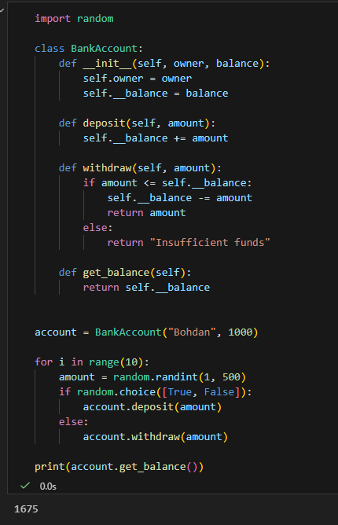
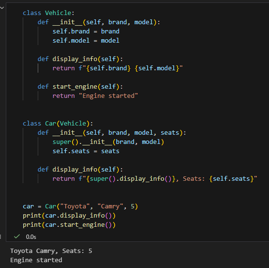
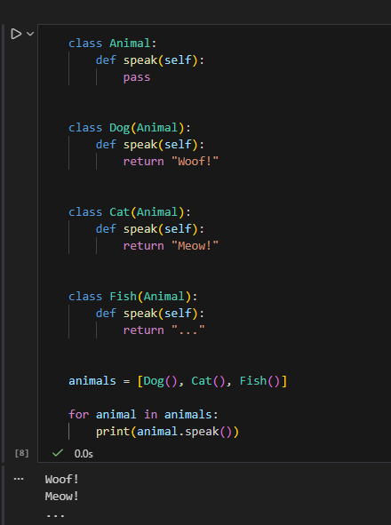
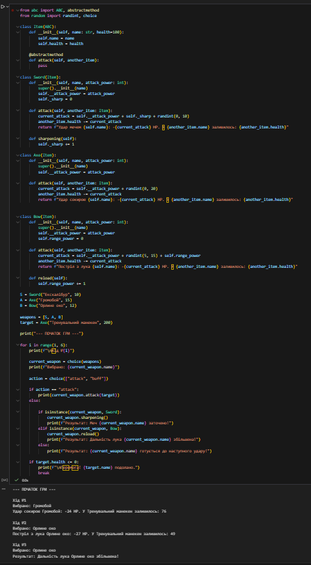

# Звіт до роботи

## Тема
_Основні парадигми ООП_

## Мета роботи
_Ознайомитись з ключовими поняттями об’єктно-орієнтованого програмування (ООП) у Python та навчитися реалізовувати їх у власних класах на прикладі ігрової симуляції._

1.

2.

3.

4.

### Результати виконання завдань
- Розробили / Створили : ігрову симуляцію за допомогою класу
- Навчились: ключовим поняттям об’єктно-орієнтованого програмування (ООП) та реалізовувати їх у власних класах на прикладі ігрової симуляції
- Проблеми: з додаванням ще одного айтему в останньому завданні
- Feedback: Такий формат здачі задовільняє але приклад звіту хотілось би розділити на простіші та зрозуміліші пункти.
---

 