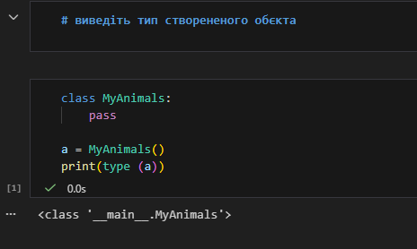
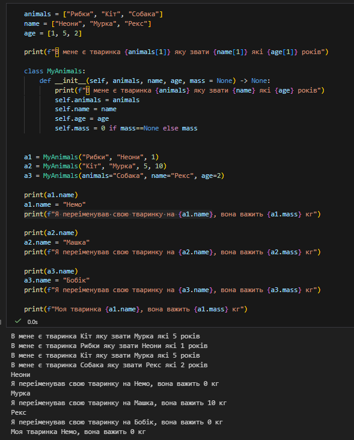
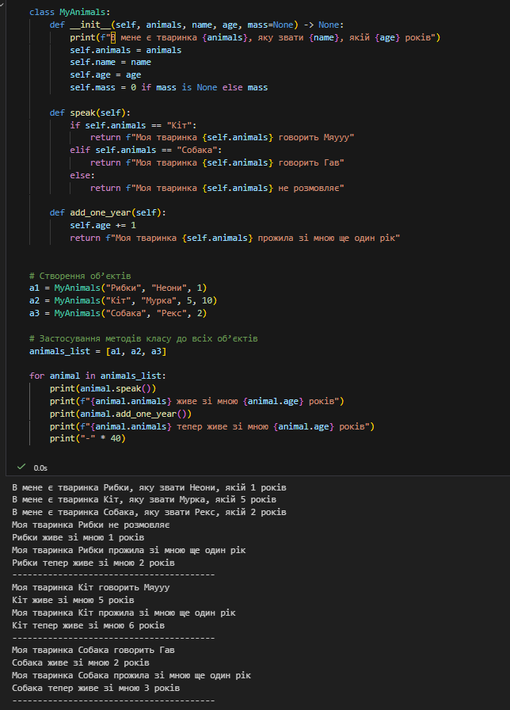
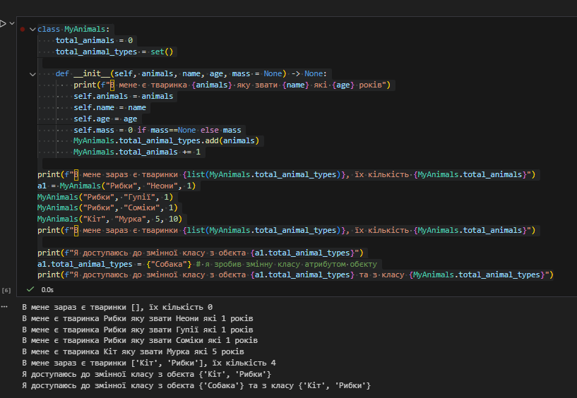
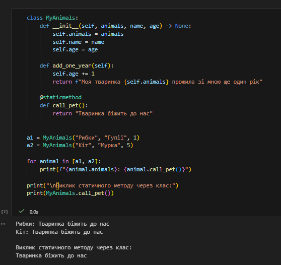
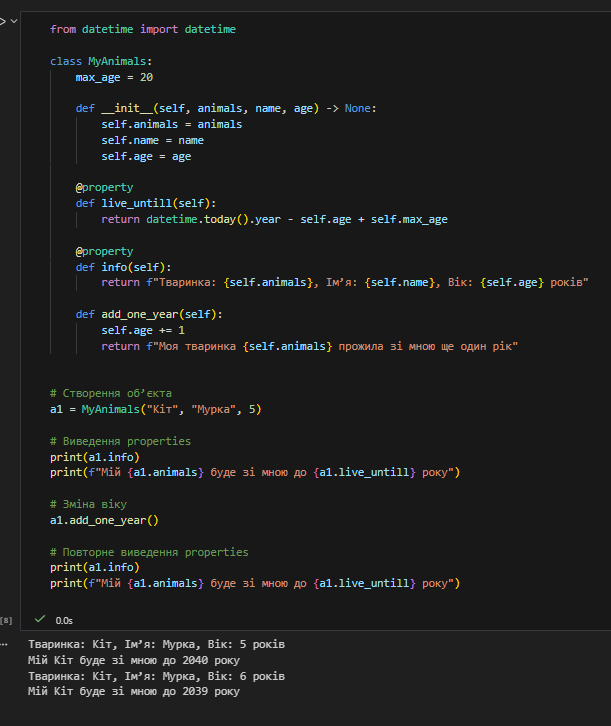
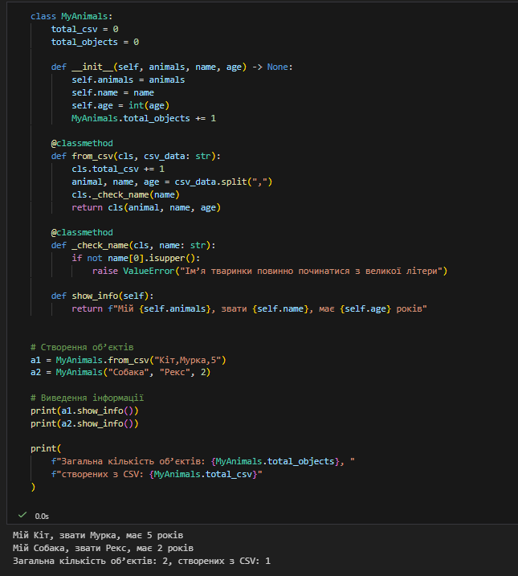

# Звіт до роботи

## Тема роботи
Програмування з використанням ООП

## Мета роботи
Навчитись працювати з Класами та його основними конструкціями

## Виконання роботи

# 1 завдання 
у ході виконання цього завдання було застосовано `print(type(a))` для виведення типу створеного об'єкту 

# 2 завдання 
в цьому завданні було застосовано команду `a1-a2-a3.name` відштовхуючись від попередньо створених змінних для об'єкту та виведено зміни через `print` 
`print(f"Я переіменував свою тваринку на {a1-a2-a3.name})`

# 3 завдання
У ході виконання роботи методи класу були застосовані до всіх створених об’єктів `a1`, `a2`, `a3`. 
Для кожного об’єкта було викликано методи `speak()` та `add_one_year()`, що дозволило перевірити 
коректність роботи класу та зміну стану об’єктів.

# 4 завдання
У програмі було створено декілька об’єктів класу `MyAnimals` у циклі.
Під час створення кожного об’єкта оновлювались глобальні змінні класу:
`total_animals` та `total_animal_types`.

Було продемонстровано доступ до змінних класу як напряму через клас,
так і через об’єкт. Також показано, що при присвоєнні значення змінній
класу через об’єкт створюється окремий атрибут об’єкта, який не змінює
значення змінної класу.

# 5 завдання 
У ході виконання роботи було викликано статичний метод `call_pet()` для
кожного об’єкта (`a1`, `a2`). Статичний метод не залежить від стану
конкретного об’єкта та може викликатися як через об’єкт, так і через клас.

# 6 завдання 
У класі було реалізовано дві властивості (`@property`): `live_untill` та `info`.
Властивість `live_untill` обчислює орієнтовний рік, до якого тваринка може жити,
а властивість `info` повертає узагальнену інформацію про об’єкт.

# 7 завдання 
У класі було реалізовано метод класу `_check_name`, який перевіряє,
чи ім’я тваринки починається з великої літери. Метод використовується
під час створення об’єктів із CSV-даних.

Метод `_check_name` є приватним (умовно), оскільки призначений для
внутрішнього використання в межах класу. У разі некоректного імені
генерується виняток `ValueError`. 

## Висновок

У ході роботи було реалізовано клас з використанням основних принципів
об’єктно-орієнтованого програмування в Python. Мету роботи досягнуто,
усі поставлені завдання виконано.

Під час виконання роботи отримано нові знання щодо використання методів
класу, статичних методів, властивостей (`@property`) та перевірки даних.
На всі питання, поставлені в ході роботи, було надано відповіді.

Формат здачі роботи у вигляді `README.md` є зручним і зрозумілим.

