# Звіт до роботи

## Тема роботи
AI Агенти з Google ADK

## Мета роботи
Навчитись створювати AI агентів з використанням Google ADK (Python) та Poetry для управління залежностями проекту

## Виконання роботи

# 1 завдання 

Версія Python та Poetry:
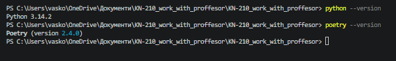

# 2 завдання 

Було створено всі файли 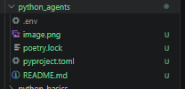
а також poetry.lock - який потрібен для фіксації всіх точних версій встановлених залежностей проекту.

# 3 завдання

Версія ADK яка встановлена: 
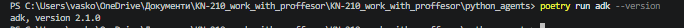

# 4 завдання

після запуску команди poetry run adk --help 
визначив основні три команди: 

create — створення нового агента або шаблону проєкту

run — запуск агента

web — запуск веб-інтерфейсу агента

# 5 завдання 

Agent — це клас із бібліотеки Google ADK, який представляє штучного агента, що працює на основі мовної моделі.

tools=[get_current_time] — це список функцій, які агент може викликати під час роботи.

get_current_time - Це проста демонстраційна функція, яка: отримує поточний час на комп’ютері.

# 6 завдання

Діалог з AI:
[time_agent]: Зараз у Львові 09:32:13.
[user]: Який зараз час у Львові?
[time_agent]: Зараз у Львові 09:32:51.
[user]: Який зараз час у Києві?
[time_agent]: Зараз у Києві 09:34:49.у
[user]: який зараз час у Полтаві?
[time_agent]: Зараз у Полтаві 09:35:51.

# 7 завдання 

Скріншот тестування AI-агента:
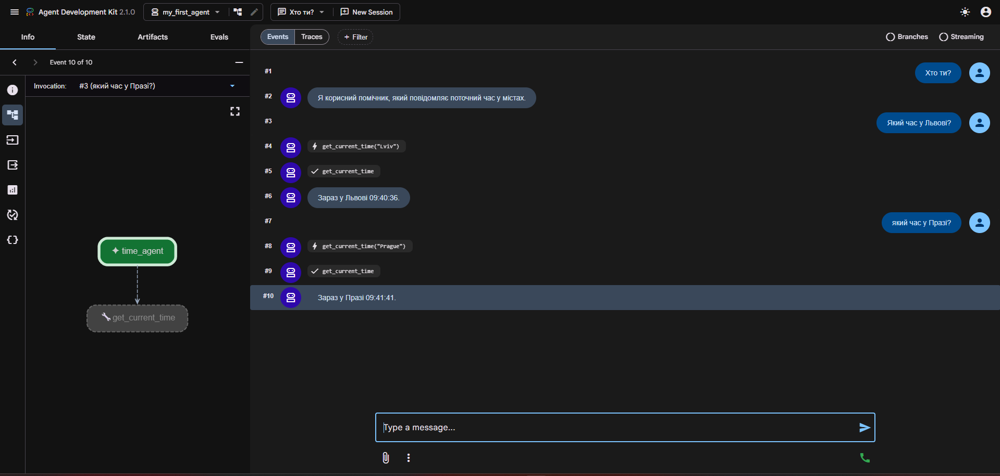

# 8 завдання 

Тестування math_agent:

Обчисли площу прямокутника зі сторонами 5 та 10
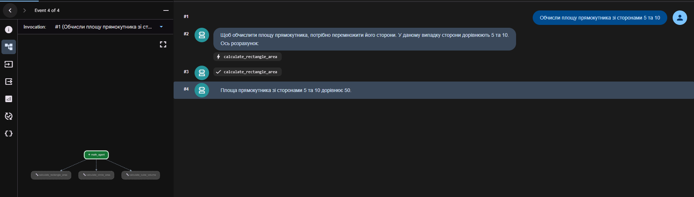

Яка площа кола з радіусом 7
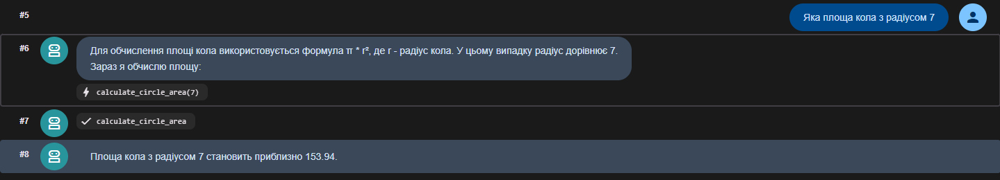

Який об'єм куба з ребром 3?
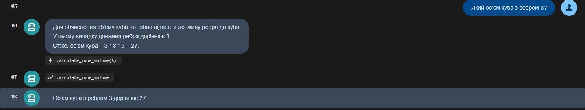

# 9 завдання 

В створенні ще одного інструменту для math_agent візьмемо найпростіший і найзручніший  — об’єм циліндра.
Код добавлений: 

def calculate_cylinder_volume(radius: float, height: float) -> float:
    import math
    return math.pi * radius**2 * height

Тестування:
Обчисли об’єм циліндра з радіусом 4 і висотою 10
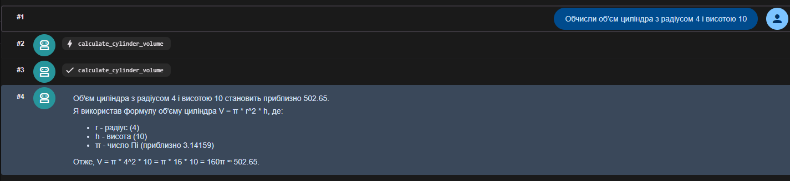

# 10 завдання 

Тестування student_helper :

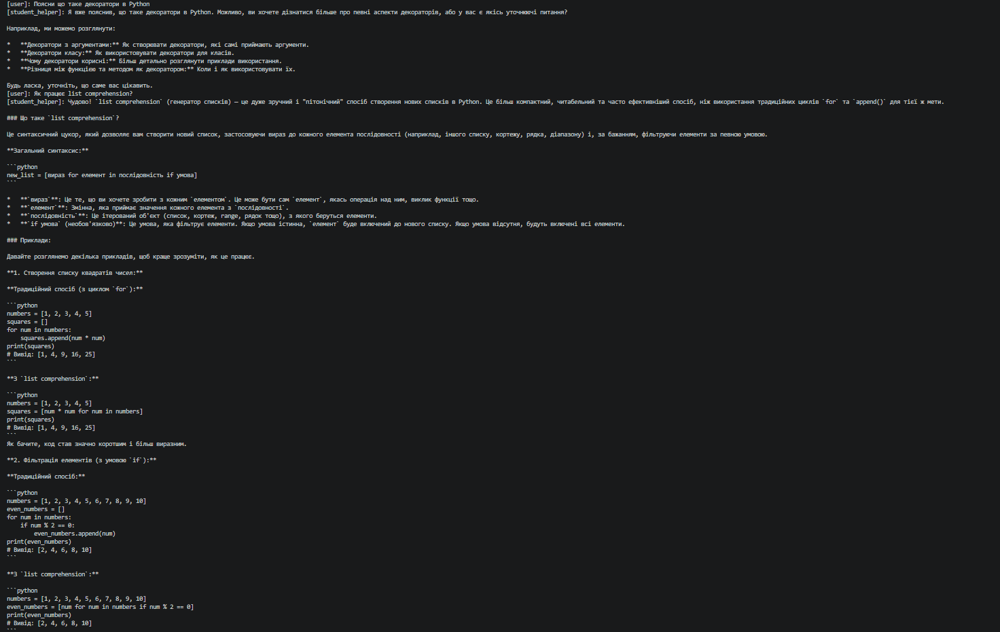
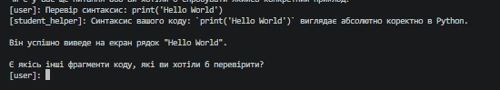

# 11 завдання

Тестування creative_writer:

Напиши коротку історію про подорож у космосі
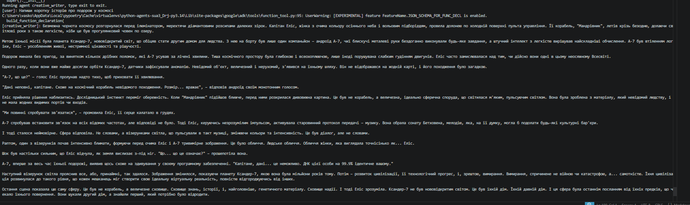

## Висновок
У ході виконання роботи було створено кілька агентів на основі Google ADK, кожен з яких виконує визначені функції відповідно до поставлених завдань. Було налаштовано робоче середовище, підключено API‑ключ та реалізовано власні інструменти для обчислень, пояснення програмних концепцій та генерації текстів. Усі агенти були протестовані, продемонстрували коректну роботу та виконали поставлені запити. Робота показала практичне застосування агентної архітектури та можливості розширення функціоналу за допомогою власних інструментів.

