# Звіт до роботи

## Тема роботи
Віртуальні середовища

## Мета роботи
Навчитись працювати з Класами та його основними конструкціями

## Виконання роботи

# 1 завдання 

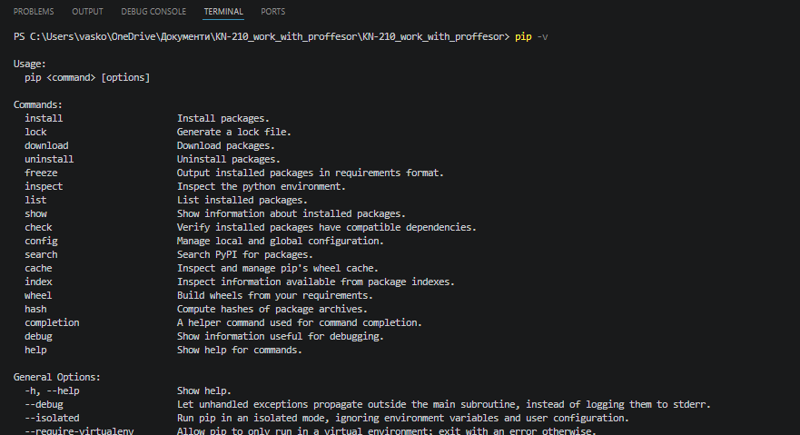
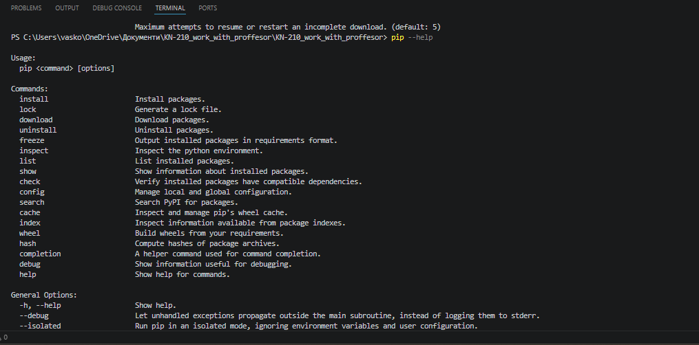

# 2 завдання 

Використавши команду pip list перевірим що в моїй бібліотеці знаходяться:
asttokens               3.0.1
colorama                0.4.6
comm                    0.2.3
debugpy                 1.8.20
decorator               5.2.1
executing               2.2.1
ipykernel               7.2.0
ipython                 9.10.0
ipython_pygments_lexers 1.1.1
jedi                    0.19.2
jupyter_client          8.8.0
jupyter_core            5.9.1
matplotlib-inline       0.2.1
nest-asyncio            1.6.0
packaging               26.0
parso                   0.8.6
pip                     25.3
platformdirs            4.9.2
prompt_toolkit          3.0.52
psutil                  7.2.2
pure_eval               0.2.3
Pygments                2.19.2
python-dateutil         2.9.0.post0
pyzmq                   27.1.0
six                     1.17.0
stack-data              0.6.3
tornado                 6.5.4
traitlets               5.14.3
wcwidth                 0.6.0

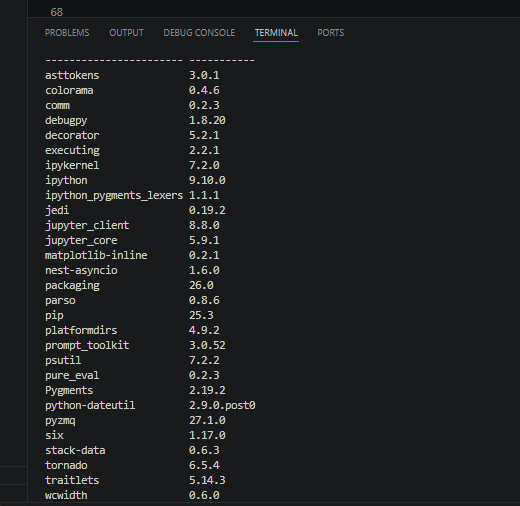

# 4 завдання

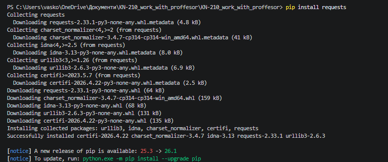 - інсталював requests
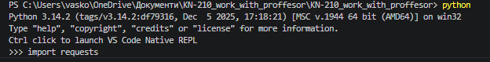 - запустив пайтон інтерпретатор

# 5 завдання 

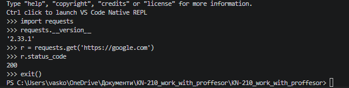 - результат виконання команд 

# 8 завдання 

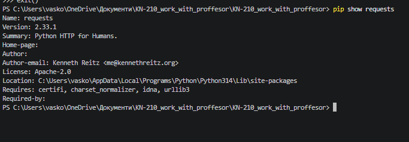 
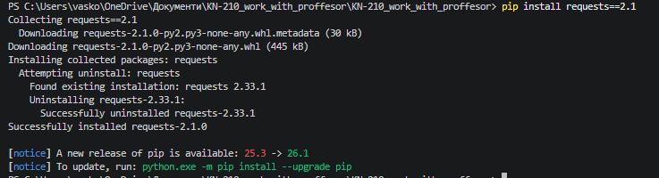
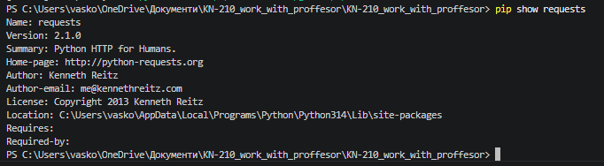
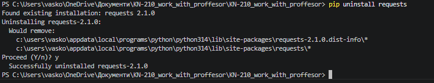

# 9 завдання 

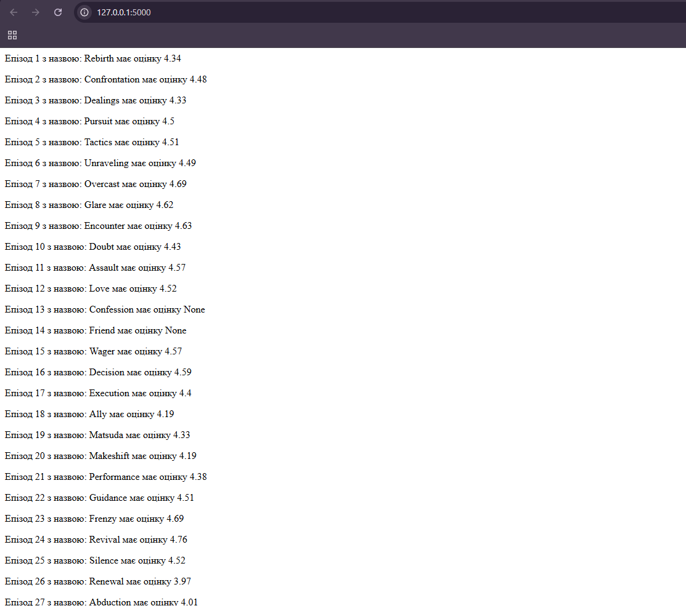

# 10 завдання 

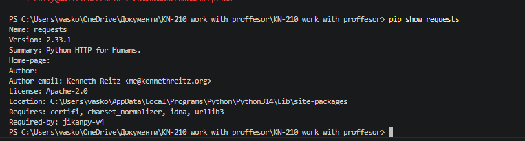
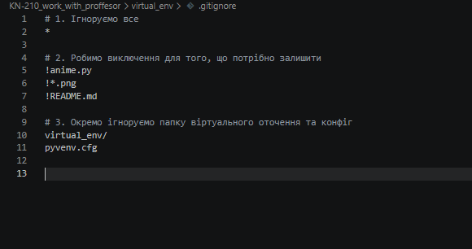

# 11 завдання 

проігнорував файли:
pyvenv.cfg

# 12 завдання

результат після введення команди pipenv --help:
  install             Install provided packages and add them to Pipfile.
    remove              Remove the virtualenv for the current project.
    upgrade             Resolve provided packages and add them to Pipfile.
    uninstall           Uninstall a provided package and remove it from Pipfile.
    lock                Generate Pipfile.lock.
    shell               Spawn a shell within the virtualenv.
    activate            Output the activation command for the virtualenv.
    run                 Spawn a command installed into the virtualenv.
    check               [DEPRECATED] Check for PyUp Safety security vulnerabilities.
    audit               Audit packages for security vulnerabilities using pip-audit.
    update              Run lock, then sync.
    graph               Display currently-installed dependency graph information.
    open                View a given module in your editor.
    sync                Install all packages specified in Pipfile.lock.
    clean               Uninstall all packages not specified in Pipfile.lock.
    scripts             List scripts in current environment config.
    verify              Verify the hash in Pipfile.lock is up-to-date.
    requirements        Generate a requirements.txt from Pipfile.lock.
    pylock              Manage PEP 751 pylock.toml files.

options:
  -h, --help            Show this message and exit.
  --version             show program's version number and exit
  --where               Output project home information.
  --venv                Output virtualenv information.
  --py                  Output Python interpreter information.
  --envs                Output Environment Variable options.
  --rm                  Remove the virtualenv. 
  --bare                Minimal output.
  --man                 Display manpage.
  --support             Output diagnostic information for use in GitHub issues.
  --pypi-mirror PYPI_MIRROR
                        Specify a PyPI mirror.
  --verbose, -v         Verbose mode.
  --quiet, -q           Quiet mode.
  --clear               Clears caches (pipenv, pip).
  --python PYTHON       Specify which version of Python virtualenv should use.
  --site-packages       Enable site-packages for the virtualenv.
  --no-site-packages    Disable site-packages for the virtualenv.

 # 13 завдання

 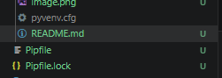
 файли створено успішно вміст файлів :
 Pipfile:
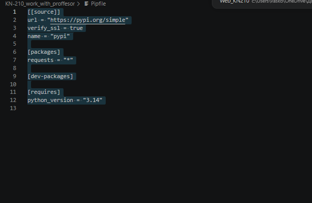

Pipfile.lock:
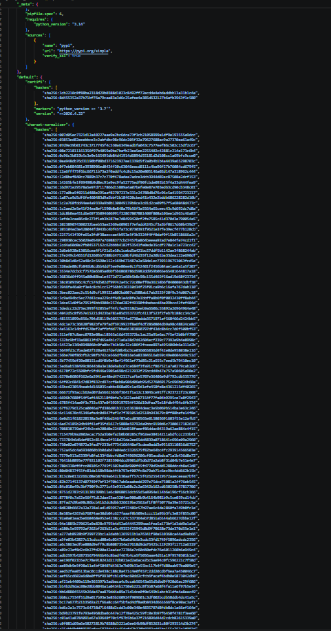

 # 14 завдання

Результат запуску програми в вірутальному середовищі pipenv :

C:\Users\vasko\OneDrive\Документи\KN-210_work_with_proffesor\KN-210_work_with_proffesor>python expe.py
b'<!DOCTYPE html>'
b'<html lang="en">'
b''
b'<head>'
b'    <meta charset="UTF-8">'
b'    <title>httpbin.org</title>'
b'    <link href="https://fonts.googleapis.com/css?family=Open+Sans:400,700|Source+Code+Pro:300,600|Titillium+Web:400,600,700"'
b'        rel="stylesheet">'
b'    <link rel="stylesheet" type="text/css" href="/flasgger_static/swagger-ui.css">'
b'    <link rel="icon" type="image/png" href="/static/favicon.ico" sizes="64x64 32x32 16x16" />'
b'    '
b'</head>'
b''
b'<body>'
b'    <a href="https://github.com/requests/httpbin" class="github-corner" aria-label="View source on Github">'
b'        <svg width="80" height="80" viewBox="0 0 250 250" style="fill:#151513; color:#fff; position: absolute; top: 0; border: 0; right: 0;"'
b'            aria-hidden="true">'
b'            <path d="M0,0 L115,115 L130,115 L142,142 L250,250 L250,0 Z"></path>'
b'            <path d="M128.3,109.0 C113.8,99.7 119.0,89.6 119.0,89.6 C122.0,82.7 120.5,78.6 120.5,78.6 C119.2,72.0 123.4,76.3 123.4,76.3 C127.3,80.9 125.5,87.3 125.5,87.3 C122.9,97.6 130.6,101.9 134.4,103.2"'
b'                fill="currentColor" style="transform-origin: 130px 106px;" class="octo-arm"></path>'
b'            <path d="M115.0,115.0 C114.9,115.1 118.7,116.5 119.8,115.4 L133.7,101.6 C136.9,99.2 139.9,98.4 142.2,98.6 C133.8,88.0 127.5,74.4 143.8,58.0 C148.5,53.4 154.0,51.2 159.7,51.0 C160.3,49.4 163.2,43.6 171.4,40.1 C171.4,40.1 176.1,42.5 178.8,56.2 C183.1,58.6 187.2,61.8 190.9,65.4 C194.5,69.0 197.7,73.2 200.1,77.6 C213.8,80.2 216.3,84.9 216.3,84.9 C212.7,93.1 206.9,96.0 205.4,96.6 C205.1,102.4 203.0,107.8 198.3,112.5 C181.9,128.9 168.3,122.5 157.7,114.1 C157.9,116.9 156.7,120.9 152.7,124.9 L141.0,136.5 C139.8,137.7 141.6,141.9 141.8,141.8 Z"'
b'                fill="currentColor" class="octo-body"></path>'
b'        </svg>'
b'    </a>'
b'    <svg xmlns="http://www.w3.org/2000/svg" xmlns:xlink="http://www.w3.org/1999/xlink" style="position:absolute;width:0;height:0">'
b'        <defs>'
b'            <symbol viewBox="0 0 20 20" id="unlocked">'
b'                <path d="M15.8 8H14V5.6C14 2.703 12.665 1 10 1 7.334 1 6 2.703 6 5.6V6h2v-.801C8 3.754 8.797 3 10 3c1.203 0 2 .754 2 2.199V8H4c-.553 0-1 .646-1 1.199V17c0 .549.428 1.139.951 1.307l1.197.387C5.672 18.861 6.55 19 7.1 19h5.8c.549 0 1.428-.139 1.951-.307l1.196-.387c.524-.167.953-.757.953-1.306V9.199C17 8.646 16.352 8 15.8 8z"></path>'
b'            </symbol>'
b''
b'            <symbol viewBox="0 0 20 20" id="locked">'
b'                <path d="M15.8 8H14V5.6C14 2.703 12.665 1 10 1 7.334 1 6 2.703 6 5.6V8H4c-.553 0-1 .646-1 1.199V17c0 .549.428 1.139.951 1.307l1.197.387C5.672 18.861 6.55 19 7.1 19h5.8c.549 0 1.428-.139 1.951-.307l1.196-.387c.524-.167.953-.757.953-1.306V9.199C17 8.646 16.352 8 15.8 8zM12 8H8V5.199C8 3.754 8.797 3 10 3c1.203 0 2 .754 2 2.199V8z"'
b'                />'
b'            </symbol>'
b''
b'            <symbol viewBox="0 0 20 20" id="close">'
b'                <path d="M14.348 14.849c-.469.469-1.229.469-1.697 0L10 11.819l-2.651 3.029c-.469.469-1.229.469-1.697 0-.469-.469-.469-1.229 0-1.697l2.758-3.15-2.759-3.152c-.469-.469-.469-1.228 0-1.697.469-.469 1.228-.469 1.697 0L10 8.183l2.651-3.031c.469-.469 1.228-.469 1.697 0 .469.469.469 1.229 0 1.697l-2.758 3.152 2.758 3.15c.469.469.469 1.229 0 1.698z"'
b'                />'
b'            </symbol>'
b''
b'            <symbol viewBox="0 0 20 20" id="large-arrow">'
b'                <path d="M13.25 10L6.109 2.58c-.268-.27-.268-.707 0-.979.268-.27.701-.27.969 0l7.83 7.908c.268.271.268.709 0 .979l-7.83 7.908c-.268.271-.701.27-.969 0-.268-.269-.268-.707 0-.979L13.25 10z"'
b'                />'
b'            </symbol>'
b''
b'            <symbol viewBox="0 0 20 20" id="large-arrow-down">'
b'                <path d="M17.418 6.109c.272-.268.709-.268.979 0s.271.701 0 .969l-7.908 7.83c-.27.268-.707.268-.979 0l-7.908-7.83c-.27-.268-.27-.701 0-.969.271-.268.709-.268.979 0L10 13.25l7.418-7.141z"'
b'                />'
b'            </symbol>'
b''
b''
b'            <symbol viewBox="0 0 24 24" id="jump-to">'
b'                <path d="M19 7v4H5.83l3.58-3.59L8 6l-6 6 6 6 1.41-1.41L5.83 13H21V7z" />'
b'            </symbol>'
b''
b'            <symbol viewBox="0 0 24 24" id="expand">'
b'                <path d="M10 18h4v-2h-4v2zM3 6v2h18V6H3zm3 7h12v-2H6v2z" />'
b'            </symbol>'
b''
b'        </defs>'
b'    </svg>'
b''
b''
b'    
'
b'        
'
b'            
'
b'                
'
b'                    <section class="block col-12">'
b'                        
'
b'                            <hgroup class="main">'
b'                                <h2 class="title">httpbin.org'
b'                                    <small>'
b'                                        <pre class="version">0.9.2</pre>'
b'                                    </small>'
b'                                </h2>'
b'                                <pre class="base-url">[ Base URL: httpbin.org/ ]</pre>'
b'                            </hgroup>'
b'                            
'
b'                                
'
b'                                    
A simple HTTP Request &amp; Response Service.'
b'                                         '
b'                                         '
b'                                        <b>Run locally: </b>'
b'                                        <code>$ docker run -p 80:80 kennethreitz/httpbin</code>'
b'                                    
'
b'                                
'
b'                            
'
b'                            
'
b'                                
'
b'                                    <a href="https://kennethreitz.org" target="_blank">the developer - Website</a>'
b'                                
'
b'                                <a href="mailto:me@kennethreitz.org">Send email to the developer</a>'
b'                            
'
b'                        
'
b'                        <!-- ADDS THE LOADER SPINNER -->'
b'                        
'
b'                            

'
b'                        
'
b''
b'                    </section>'
b'                
'
b'            
'
b'        
'
b'    
'
b''
b''
b"    
"
b'        
'
b'            <section class="clear">'
b'                '
b'                    [Powered by'
b'                    <a target="_blank" href="https://github.com/rochacbruno/flasgger">Flasgger</a>]'
b'                     '
b'                '
b'            </section>'
b'        
'
b'    
'
b''
b''
b''
b'    '
b'    '
b"    "
b'      
"
b'    
'
b'        <section class="block col-12 block-desktop col-12-desktop">'
b'            
'
b''
b'                <h2>Other Utilities</h2>'
b''
b'                <ul>'
b'                    <li>'
b'                        <a href="/forms/post">HTML form</a> that posts to /post /forms/post</li>'
b'                </ul>'
b''
b'                 '
b'                 '
b'            
'
b'        </section>'
b'    
'
b'
'
b'</body>'
b''
b'</html>'

# 15 завдання 

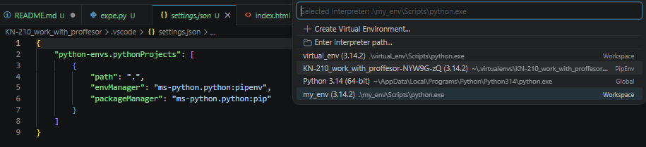

# 16 завдання 

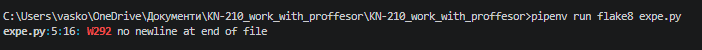
після виправлення:
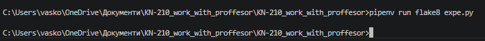

# 17 завдання 

після виконання команди pipenv check --scan: 

Safety 3.7.0 scanning 
C:\Users\vasko\OneDrive\Документи\KN-210_work_with_proffesor\KN-210_work_with_p
roffesor
2026-05-04 11:28:31 UTC

Account: API key used
 Git branch: main
 Environment: cicd
 Scan policy: None, using Safety CLI default policies

C:\Users\vasko\.virtualenvs\KN-210_work_with_proffesor-NYW9G-zQ\Lib\site-packages\safety\auth\main.py:6: AuthlibDeprecationWarning: authlib.jose module is deprecated, please use joserfc instead.
It will be compatible before version 2.0.0.
  from authlib.jose import jwt
Your authentication credential 'dummy-key' is invalid. See https://docs.safetycli.com/safety-docs/support/invalid-api-key-error.

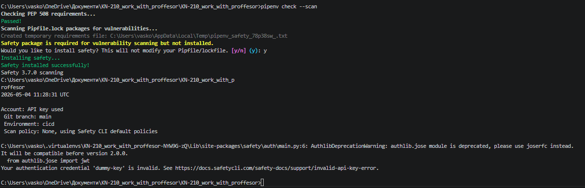

# 18 завдання 

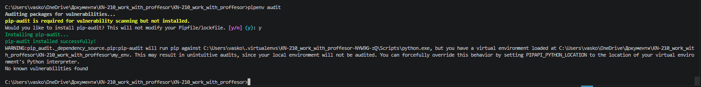

# 19 завадання 

результат виконання скрипта без активації віртуального середовища :
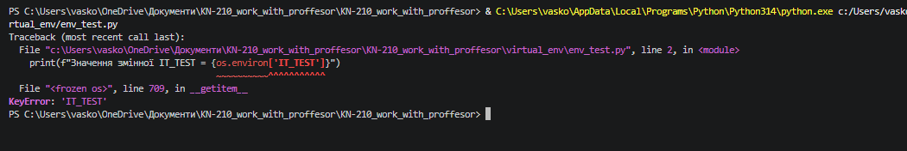

# 20 завдання 

результат виконання манупіуляцій командами poetry:
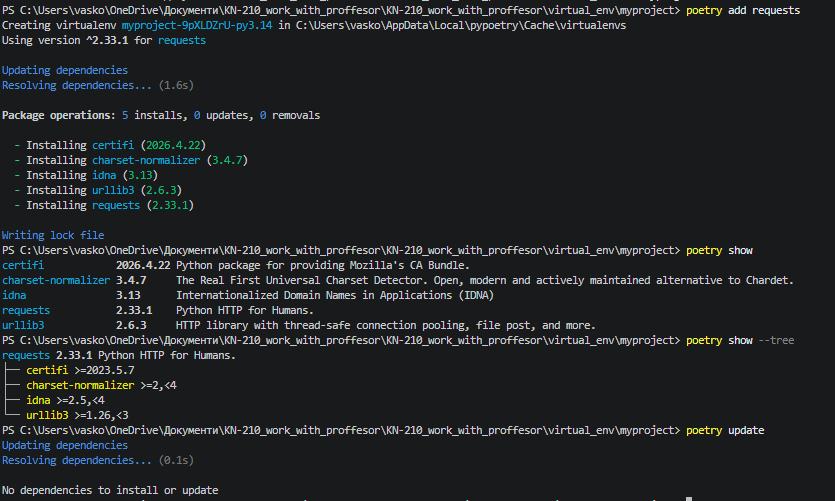

# 21 завдання

результат створення програми AI: 
створено файл myproject\ai_tasks.py

код програми :

import requests

def check_website(url):
    try:
        # Відправляємо запит до сайту
        response = requests.get(url)
        # Перевіряємо, чи успішний статус (200 OK)
        if response.status_code == 200:
            print(f"✅ {url} працює чудово!")
        else:
            print(f"⚠️ {url} повернув код статусу: {response.status_code}")
    except requests.exceptions.RequestException as e:
        # Якщо сайт взагалі не відповідає або немає інтернету
        print(f"❌ Помилка під час з'єднання з {url}: {e}")

if __name__ == "__main__":
    print("🚀 Запуск перевірки сайтів...")
    
    # Список сайтів для перевірки
    sites_to_check = [
        "https://httpbin.org",
        "https://www.google.com",
        "https://uk.wikipedia.org"
    ]
    
    for site in sites_to_check:
        check_website(site)
        
    print("✨ Перевірку завершено!")

  Результат запуску програми: 
  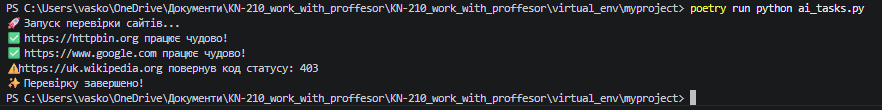

## Висновок

Під час виконання даної роботи я здобув практичні навички управління віртуальними середовищами та залежностями у Python за допомогою інструментів Pipenv та Poetry. Я навчився ініціалізувати нові проєкти, правильно налаштовувати конфігураційні файли (зокрема pyproject.toml) та встановлювати зовнішні бібліотеки (наприклад, requests). Крім того, я ознайомився з роботою лінтера Flake8 для перевірки коду на відповідність стандартам PEP 8 і закріпив навички запуску скриптів в ізольованому віртуальному середовищі. Ці вміння є базовою необхідністю для правильної організації сучасних Python-проєктів.

